# Farm Life — Sơ đồ thiết kế (Target: Project hoàn chỉnh)

Tài liệu mô tả **kiến trúc đích** khi Farm Life hoàn thành toàn bộ roadmap (Phase 1–5).  
Chú thích: **✅ đã có** | **🔶 một phần** | **⬜ kế hoạch**

---

## 1. Tổng quan hệ thống

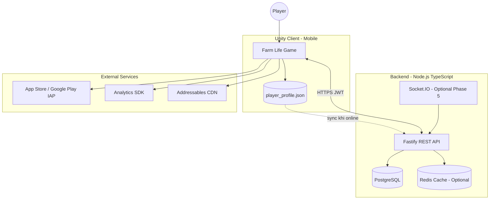

---

## 2. Unity — Kiến trúc phân lớp (Clean / SOLID)

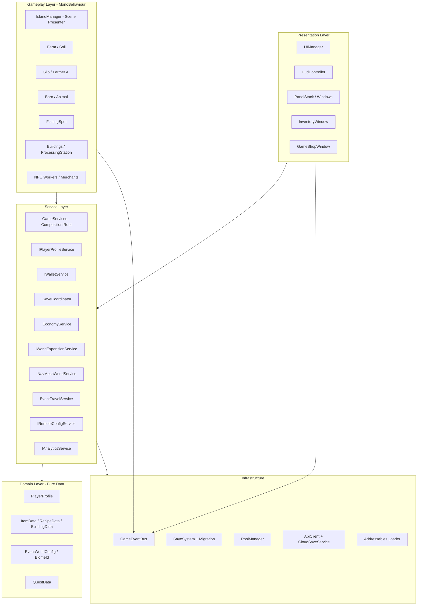

| Lớp | Trách nhiệm | Trạng thái |
|-----|-------------|-----------|
| Domain | Models, SO config, không Unity lifecycle | 🔶 |
| Services | Business rules, wallet, economy, save | 🔶 |
| Gameplay | Scene objects, animation, triggers | ✅ |
| Presentation | HUD, windows, juice | 🔶 |
| Infrastructure | IO, network, pooling, events | 🔶 |

---

## 3. Core gameplay loop (Tycoon)

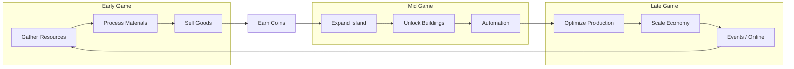

---

## 4. Cấu trúc thế giới & Scene

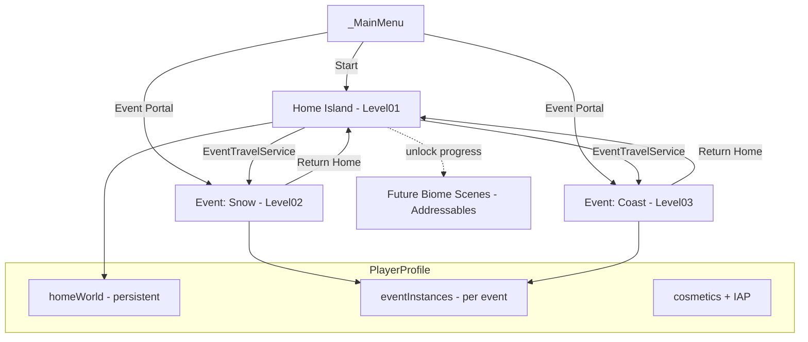

### Biome progression (logical trên Home — ⬜ Phase 2+)

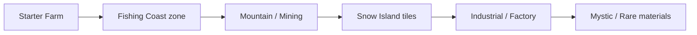

---

## 5. Mô hình dữ liệu — PlayerProfile

```mermaid
erDiagram
    PlayerProfile ||--|| HomeWorldData : contains
    PlayerProfile ||--|| CosmeticsData : contains
    PlayerProfile ||--o{ EventInstanceData : has

    PlayerProfile {
        string profileId
        int saveVersion
        string lastSaveUtc
    }

    HomeWorldData {
        int Coin
        list unlockedIslands
        list inventories
        list silos
        int array animalLevels
        list questProgress
        map biomeFlags
    }

    EventInstanceData {
        string eventId
        string sceneName
        int coins
        list inventories
    }

    CosmeticsData {
        list ownedSkinIds
        string equippedSkinId
        list completedIAPProductIds
    }
```

**Nguồn sự thật:** `player_profile.json` (local) ↔ cloud JSONB (server).

---

## 6. Economy & Production pipeline

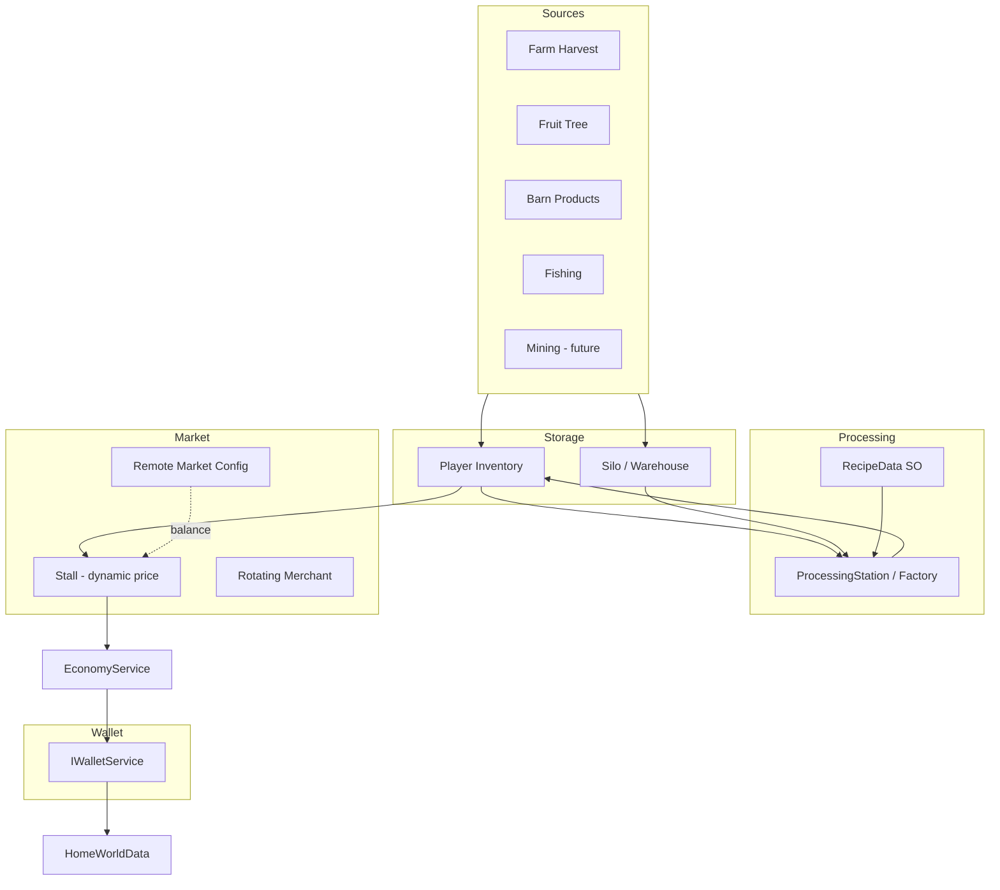

---

## 7. Automation & NPC (Target)

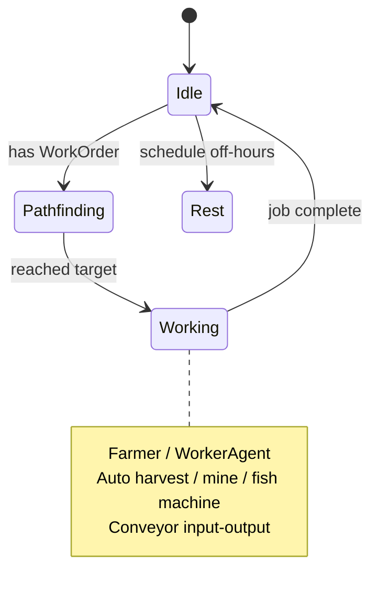

| Thành phần | Vai trò | Trạng thái |
|------------|---------|-----------|
| `Farmer` (NavMesh) | Auto farm loop per silo | ✅ |
| `WorkerAgent` + `WorkOrder` | Generic worker pool | ⬜ |
| Conveyor / machines | Industrial biome | ⬜ |
| NPC schedule + state machine | Merchants, customers | ⬜ |

---

## 8. Event bus & hệ thống phụ thuộc

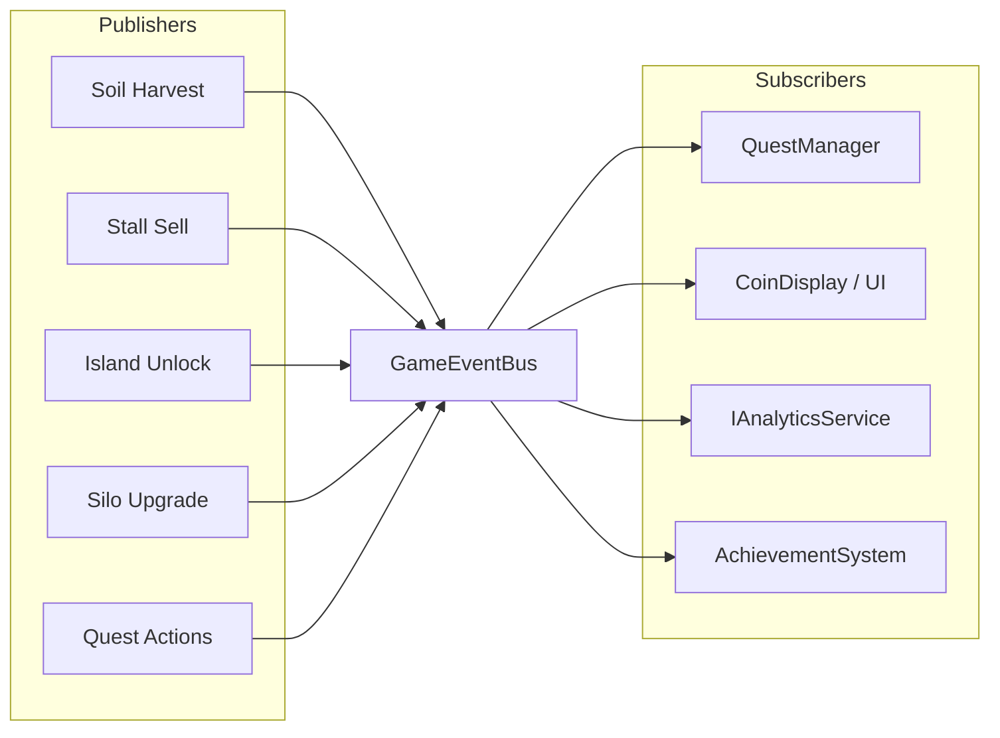

---

## 9. Luồng Save & Cloud (Offline-first)

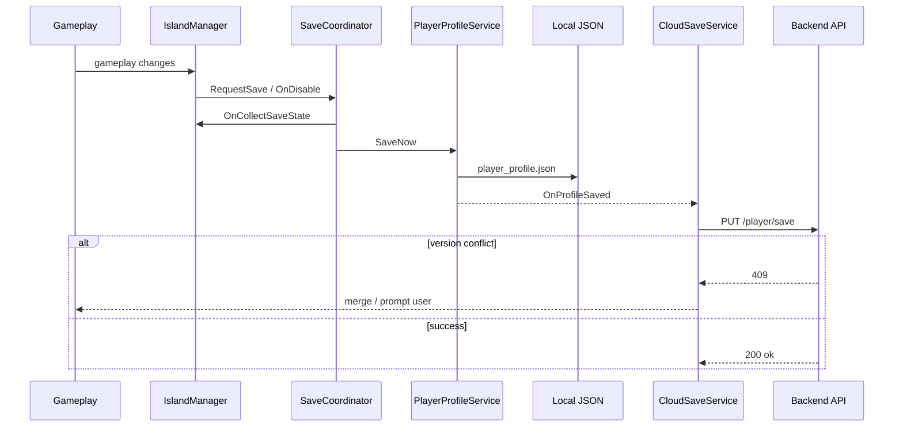

---

## 10. Backend — Kiến trúc đích (Phase 1–5)

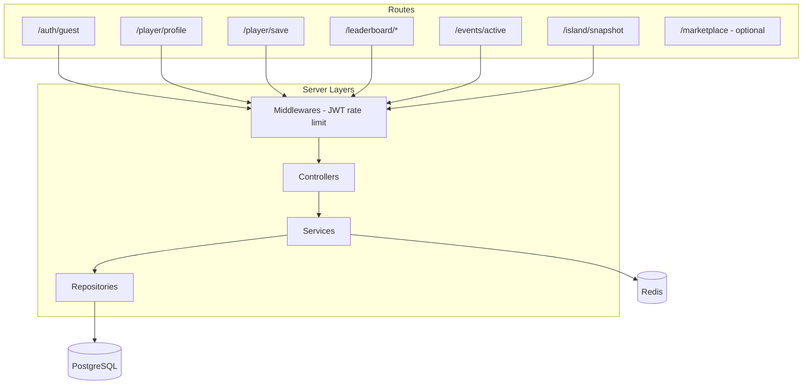

| Phase | API / Feature | Trạng thái |
|-------|----------------|-----------|
| 1 | Guest auth, profile, cloud save | 🔶 |
| 2 | Leaderboard + anti-cheat validation | ⬜ |
| 3 | Live events, remote balancing | ⬜ |
| 4 | Async island visit / snapshot | ⬜ |
| 5 | Realtime trade, guild, chat | ⬜ |

---

## 11. UI / UX kiến trúc (Target)

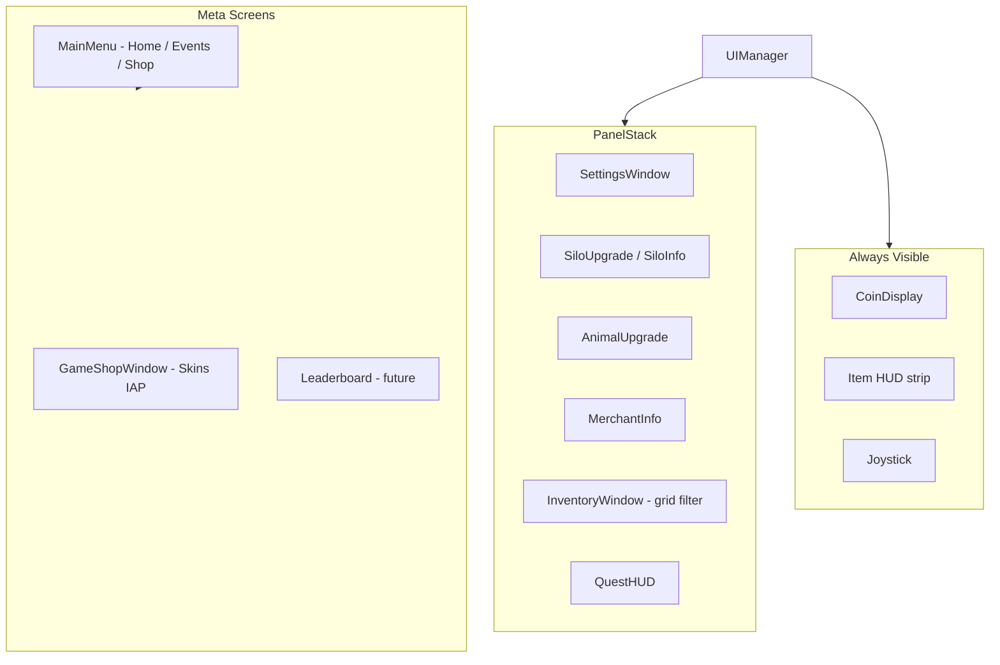

**Style hướng:** bright, cozy, mobile-first (Dreamdale / Family Farm Adventure).

---

## 12. Monetization & Analytics (Soft)

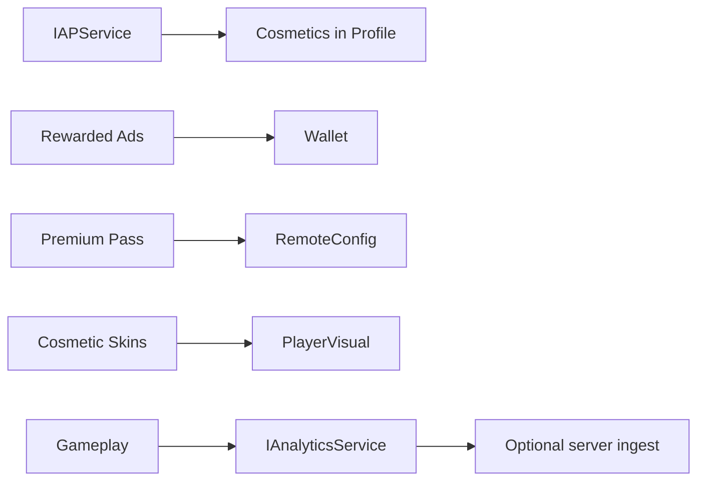

Không pay-to-win nặng: cosmetics, convenience, battle pass style.

---

## 13. Performance & Content delivery

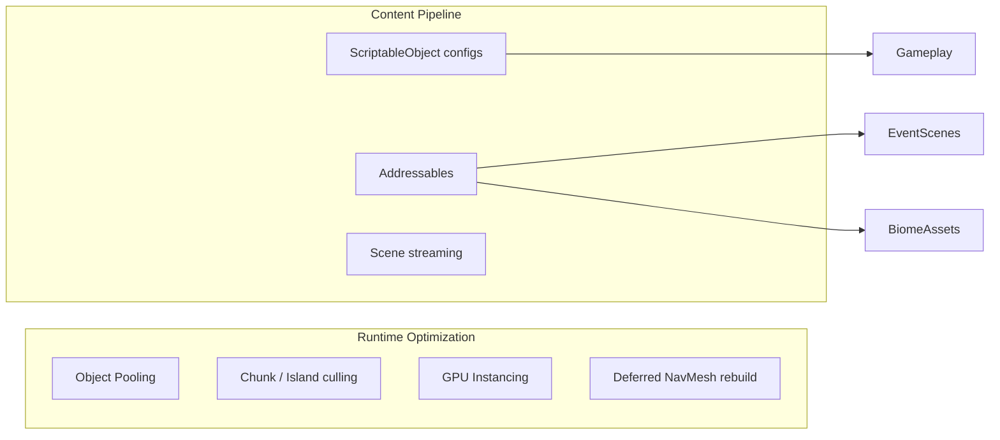

---

## 14. Map triển khai: Hiện tại → Hoàn chỉnh

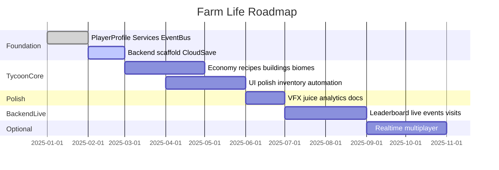

---

## 15. Nguyên tắc thiết kế (không đổi)

1. **Offline-first** — local profile là source of truth; cloud merge theo `saveVersion`.
2. **IslandManager = presenter** — không gom economy + save + mesh forever.
3. **Data-driven** — balance qua SO + remote config, không hardcode trong client.
4. **Event maps tách progression** — Home persistent, event instance riêng.
5. **Mobile performance first** — pool, chunk, async load.

---

## Tài liệu liên quan

- [ARCHITECTURE.md](ARCHITECTURE.md) — trạng thái implementation hiện tại
- [server/README.md](../../server/README.md) — API & Docker
- Master plan — `.cursor/plans/farm_life_refactor_*.plan.md`
