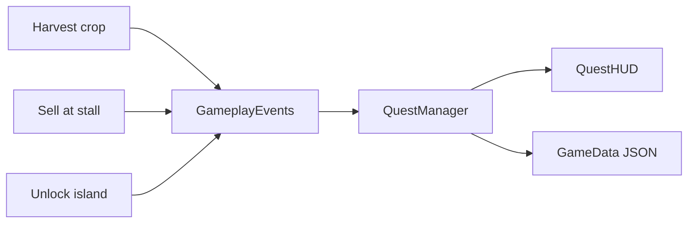

# Island Harvest

**3D mobile farming simulator** — island expansion, automation, **daily quests**.

Unity 6 · URP · Android / iOS

---

## 1. Đây là game gì?

Khám phá đảo, trồng trọt, chăn nuôi, câu cá, bán hàng kiếm coin, mở khóa đảo mới, hoàn thành **nhiệm vụ ngày** để nhận thưởng, rồi qua 3 level.

**Core loop:** farm → harvest → sell → daily quest → mở đảo → automate

---

## 2. Bạn làm gì?

- **Rebrand:** `Island Harvest`, namespace `IslandHarvest.Game`, bundle `com.islandharvest.game`
- **Daily Quest system** (mới): ScriptableObject quests, `QuestManager`, runtime HUD, save trong `GameData`
- **Save migration:** Binary `.dat` → JSON `.json` + `saveVersion` + legacy import
- **Gameplay hooks:** `GameplayEvents` cho harvest / stall / unlock island
- **Mobile:** pooling, URP render scale, spatial island grid, touch + haptics

*Base project evolved from a licensed Unity farming template — see [CREDITS.md](CREDITS.md).*

---

## 3. Có gì technical đáng chú ý?

| Area | Detail |
|------|--------|
| **Daily quests** | Data-driven `QuestData`, event-driven progress, UTC daily reset |
| **Save** | `JsonUtility` + version field; auto-migrate old `.dat` saves |
| **Pooling** | Crops, fruit, stall, coins — `PoolManager` |
| **Island expansion** | `Vector3Int` spatial grid, incremental mesh refresh |
| **Mobile graphics** | URP render scale, shadow toggle, 60 FPS target |

**Stack:** Unity 6000.3 · URP 17 · Cinemachine · AI Navigation 2 · DOTween · SimpleInput



---

## 4. Có playable / video không?

| | |
|---|---|
| **Playable** | Build APK — hướng dẫn [BUILD.md](BUILD.md). Hoặc clone repo → Unity **6000.3.10f1** → Play `_MainMenu`. |
| **Video** | *(Thêm link YouTube gameplay 60–90s)* |
| **itch.io** | *(Thêm link sau khi upload APK)* |

---

## Development scope

| Implemented by project owner | From template / third-party |
|------------------------------|----------------------------|
| Rebrand, namespace, bundle ID | Core farming / island / animal loops |
| `QuestManager`, `QuestHUD`, `GameplayEvents` | URP assets, animations, level layout |
| JSON save + migration | DOTween, SimpleInput, TMP |
| README, CREDITS, BUILD docs | Original 3D art/audio (until replaced) |

---

## Chạy nhanh

```
Unity 6000.3.10f1
Tools → Island Harvest → Create Default Quest Assets   (first time)
Open Assets/_Game/Scenes/_MainMenu.unity → Play
```

**Scenes:** `_MainMenu` · `Level01` · `Level02` · `Level03`

**Editor:** `Tools → Island Harvest → Save File Manager`

---

## Credits

[CREDITS.md](CREDITS.md) · [Third-Party Notices](Assets/_Game/Third-Party%20Notices.txt)
